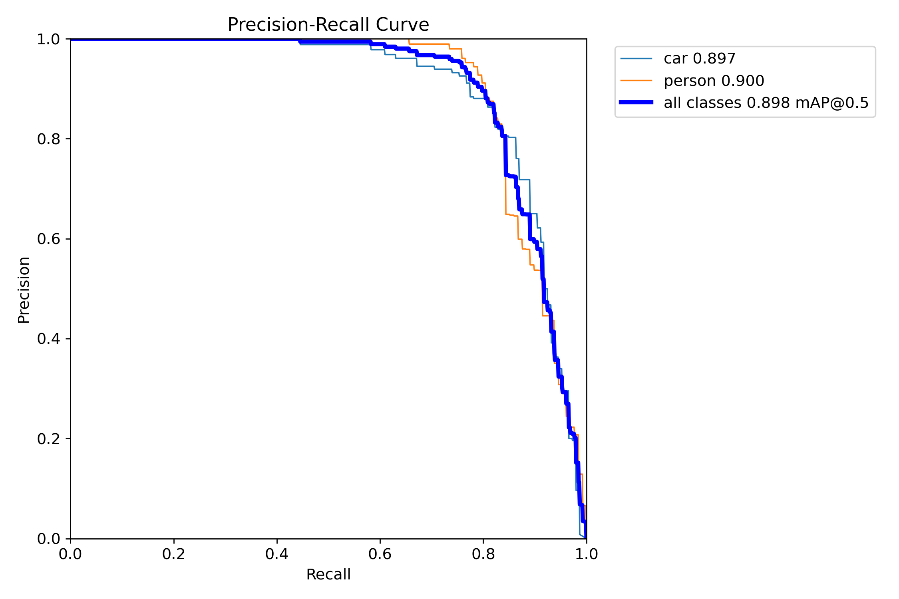

# Advanced Driver Assistance System (ADAS) — Tiny Object Detection & Lane Detection  
**Track A Submission | Tiny Detector + Lane Detection Baseline**  
**Author:** Shashank  

---

##  Project Overview  
This repository showcases the implementation of a **lightweight perception pipeline** for Advanced Driver Assistance Systems (ADAS).  
It integrates two key components:
1. **Tiny Object Detection** — Detecting *cars* and *persons* using a YOLOv8n-based lightweight model.  
2. **Lane Detection Baseline** — Implementing a simple yet effective *Canny + Hough Transform* approach for lane line extraction.  

The project emphasizes **computational efficiency, real-time inference**, and **robustness under constrained edge hardware environments**.

---

##  Architecture Overview  

**Pipeline Components:**  
1. **Data Preparation:** Small open-source dataset (Roboflow variant with “car” and “person” classes).  
2. **Model Training:** YOLOv8n (Nano) architecture trained for 30 epochs.  
3. **Model Export:** Exported to both `.onnx` and quantized `.onnx (INT8)` formats.  
4. **Evaluation:** Measured **mAP@0.5**, **FPS on CPU**, **model size**, and **false positives**.  
5. **Bonus:** Canny + Hough lane detection evaluated on ~20 top-view road frames.  

---

##  Model Information  

| Model Type | File Name | Size (MB) | Description |
|-------------|------------|-----------|--------------|
| YOLOv8n (FP32) | `model_30epochs.pt` | 5.98 MB | Baseline trained model |
| YOLOv8n (ONNX) | `model_30epochs.onnx` | 11.79 MB | Exported for inference |
| YOLOv8n (INT8 Quantized) | `model_int8.onnx` | 3.29 MB | Post-training quantized model |

---

##  Performance Metrics  

| Metric | Value | Description |
|---------|--------|-------------|
| **mAP@0.5** | 0.8964 | Mean Average Precision at IoU=0.5 |
| **Precision** | 0.8843 | Ratio of true positives over all detections |
| **Recall** | 0.7986 | Detection completeness |
| **F1-Score** | 0.839 | Harmonic mean of Precision and Recall |
| **FPS (CPU)** | 18.2 | Frames processed per second on CPU |
| **False Positives During Testing** | 48 detections | Evaluated on unseen validation set |

> These metrics were computed using the YOLO evaluation framework and validated against the ground-truth annotations in the test split.

---

##  Training Visualizations  
All visual performance plots are available under [`results/`](./results):

## Validation Metrics

## Validation Metrics and Plots

| Metric / Curve             | Description                         | Figure |
|----------------------------|-------------------------------------|--------|
| **Precision (P)**          | Model precision across thresholds    |  |
| **Recall (R)**             | Model recall across thresholds       |  |
| **Precision-Recall (PR)**  | Combined precision-recall behavior   |  |
| **F1 Score**               | F1 score across thresholds           |  |
| **Confusion Matrix**       | True vs predicted class comparison   |  |

